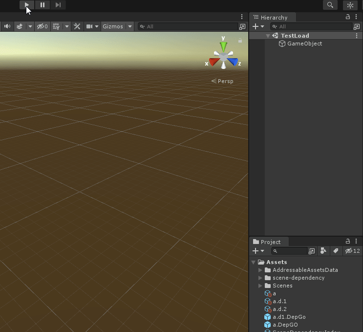

# SceneDependency (WIP)
- Automatically build dependencies index everytime a scene is saved, and pack all scenes' dependencies configuration into one single asset.
- The saved dependencies is used when `SceneDependencyRuntime.LoadSceneAsync` is called, all the dependencies will be prepared before the subject scene is loaded.
- Should be highly compatible to all kinds of project setups.
- Supports both Unity's built-in system (SceneManager) and Addressables.

# Example

Depedendency diagram:

> A
> - A.Dep1
>   - A.Dep1.Dep1
>   - A.Dep1+2.Dep (Depended by both A.Dep1 and A.Dep2)
> - A.Dep2
>   - A.Dep1+2.Dep (Depended by both A.Dep1 and A.Dep2)

We execute `SceneDependencyRuntime.LoadSceneAsync`, targeting scene `A`.

