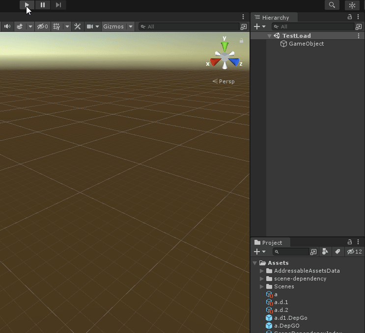

# SceneDependency

Automatic scene dependency management for Unity, built on Addressables.

- Automatically builds a dependency index every time a scene is saved
- When `SceneDependencyRuntime.LoadSceneAsync` is called, all dependencies (including transitive) are loaded before the subject scene
- Fully async/await API returning `AsyncOperationHandle<SceneInstance>`
- Works in Editor play mode, fast enter play mode (no domain reload), and player builds

## Dependency diagram example

```
A  
├──A.Dep1  
│  ├── A.Dep1.Dep  
│  └──A.Dep1+2.Dep (Depended by both A.Dep1 and A.Dep2)  
└──A.Dep2  
   ├──A.Dep2.Dep  
   └──A.Dep1+2.Dep (Depended by both A.Dep1 and A.Dep2)  
```

```csharp
await SceneDependencyRuntime.LoadSceneAsync(sceneRef, LoadSceneMode.Single);
// All deps loaded, master scene active.
await SceneDependencyRuntime.UnloadSceneAsync(sceneRef);
```



## Setup

1. **Create a `SceneDependency` ScriptableObject** for every scene that has dependencies (right-click > Create > SceneDependency)
2. **Configure it**: set the `subject` AssetReference to the scene itself, and `scenes` to its dependencies. All referenced scenes must be marked Addressable.
3. **Add a `SceneDependencyProxy`** MonoBehaviour to a root GameObject in the scene, referencing the `SceneDependency` config. This is optional if you don't need the `LoadedAsDep` callback.
4. **Save the scene**. The editor hook automatically indexes the dependency and ensures the `SceneDependencyIndex` asset is Addressable with the label `SceneDependency.Index`.
5. **Call `SceneDependencyRuntime.LoadSceneAsync`** at runtime. The framework resolves the full dependency tree (including deps of deps), loads them in parallel, then loads the master scene.

## Requirements

- Unity Addressables package (`com.unity.addressables`)
- All scenes referenced in dependency configs must be marked as Addressable assets

## How it works

- The `SceneDependencyIndex` is a project-level singleton ScriptableObject mapping scene asset GUIDs to their dependency configs
- In Editor, the index is accessed directly via `AssetDatabase`. In player builds, it's loaded by Addressable label
- The runtime resolves dependencies recursively (leaf-first, diamond-safe) and loads them via `Addressables.LoadSceneAsync`
- All loaded scene handles are tracked for proper `Addressables.UnloadSceneAsync` cleanup
- Static state is reset via `[RuntimeInitializeOnLoadMethod(SubsystemRegistration)]` for fast enter play mode compatibility
